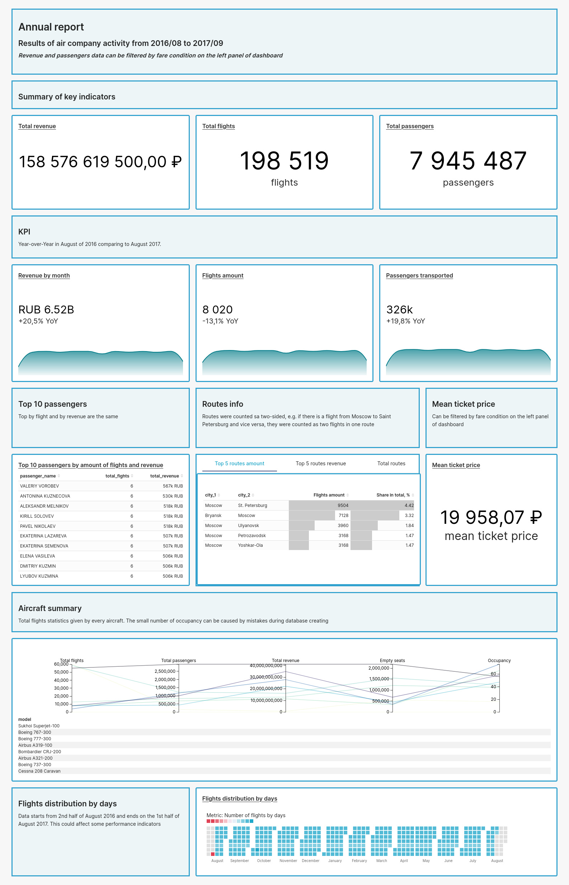

# About

Dashborad of airline company activity report for a year from 08.2016 to 08.2017. The dashboard consist of revenue and number of passengers and flights metrics by total, by month and by aircrafts, popular routes info.

# Description

Dashboard was biult using Apache Superset - a open source  business intelligence visualization platform in web application format.

Data are demo [database](https://postgrespro.ru/education/demodb) made by PostgresPro. This demo database is distributed under the [PostgreSQL license](https://www.postgresql.org/about/licence/). The big database was used in this project and can be downloaded by direct link https://edu.postgrespro.ru/demo-big.zip.

To not install Apache Superset and PostgeSQL client on local machine, it was decided to put them in docker containers and up them using docker compose.

# Getting Started

The project was built in Ubuntu operating system. There could be different steps for other OS.

1. Clone this repo (for help see this [tutorial](https://docs.github.com/repositories/creating-and-managing-repositories/cloning-a-repository)).
2. Database file is to big to palce it in github, so it can be downloaded from the link above, then extract it, name "02_demo_big_20170815.sql" and move into migrations folder.
3. Build images in the docker-compose.yml file using `sudo docker compose build` command in terminal.
4. Start the containers running `sudo docker compose up` command. Wait until  `database system is ready to accept connections` and `127.0.0.1 - - [*time*] "GET /health HTTP/1.1" 200 2 "-" "curl/7.88.1"` messages will appear in database and superset logs correspondingly.
5. Open web-browser, type `localhost/`. It opens supeset's login page. The USERNAME is `admin`, the PASSWORD is `admin_pas`.
6. Import dashboard. Most likely, it won't be imported by unknown reasons (Probably because of hashed names of dashboards component). Therefore follow to `extras` folder for manual launching.

If docker and docker compose aren't installed, see, how [Install Docker Engine](https://docs.docker.com/engine/install/) and [Install the Compose plugin](https://docs.docker.com/compose/install/linux/) on Linux system or choose your OS.

# Notes

## General notes

Database uses random data, so there are empty flights, which mean that status of flights is "Arrived", but there are no boarding passes on them. Perhaps, that filghts weren't passenger, maybe were cargo.

## Techincal notes

The changes in default Superset's setting are in config.py file. For instance, new locale parameters were added.

Superset visualizations are timing out after 60 seconds with an error message. Changing SUPERSET_WEBSERVER_TIMEOUT in superset_config.py file doesn't work. To be able to build charts with a long execution time the several materialized views were created.

Language of database is switched to English to more convenient usages of data.

# Technologies

**PostgeSQL**: JOINs, CTE, Window functions, Grouping, Filtering, Views.

**Apache Superset**: Virtual datasets, CSS, Charts (Big Number, Big Number with Trendline, Calendar Heatmap, Table, Parallel Coordinates), Filters, Configuration setting.

**Docker, Docker Compose**: DockerFile, docker-compose.yml.

# Results

Key metrics of airline company activity were presented in visual dashboard format. Financial results are steady. The most spent passengers can be treated as to be encourage by some sales, extra miles or other bonus in loyalty program. Low occupancy of aircrafts is a signal to make deeper analysis or to make some business decisions.
